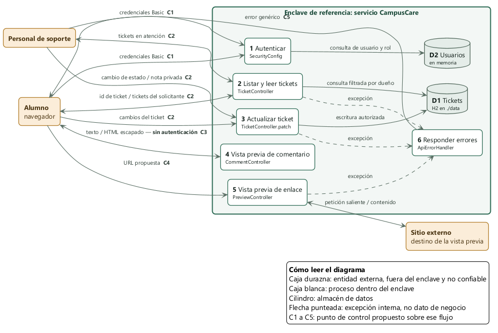

# Avance 1 — CampusCare

**Ciberseguridad Aplicada · Unidad 1**
Freddy Ali Castro Román (líder) · José Luis Islas Molina · José Eduardo Aguilar García · Christopher Álvarez Centeno · Daniel Buelna Andujo

**Commit analizado:** `76d9fcf` — *chore: importar baseline oficial de CampusCare*.

Nos repartimos el baseline entre los cinco: cada quien tomó una amenaza o una decisión, la corrió en su máquina y escribió lo que encontró. Todo lo que sigue lo comprobamos contra `localhost:8080` antes de darlo por bueno, no lo supusimos leyendo el código nada más.

## 1. Amenazas identificadas con STRIDE

Elegimos tres que se pueden demostrar con un comando, no con un escenario hipotético.

### A1 · Spoofing — las cuatro cuentas comparten contraseña, y en texto claro

*Encontrado por Daniel.* Las cuatro cuentas de prueba usan `demo123`, y como el proyecto es un repositorio público de curso, cualquiera que abra `SecurityConfig.java` la ve escrita cuatro veces junto al bean `NoOpPasswordEncoder`. No hace falta romper nada ni adivinar: basta con leer el archivo para poder autenticarse como `admin` y operar como si fuéramos soporte.

**Control propuesto:** hashear con BCrypt usando un `DelegatingPasswordEncoder`, y sacar la contraseña del código hacia una variable de entorno.

### A2 · Tampering — el PATCH de tickets deja escribir campos que no debería

*Encontrado por José Eduardo.* `PATCH /api/tickets/{id}` (método `patch()` en `TicketController.java`) recibe un `Map<String,Object>` y copia cualquier clave que reconozca, sin distinguir cuáles son seguras. En la práctica eso significa que un alumno puede mandar `{"owner": "otro-nombre"}` y quedarse con el ticket de alguien más, o apagarle la bandera `privateNote` en la misma petición. De los tres hallazgos, este es el único que además de leer, escribe — por eso nos pareció el más urgente de justificar.

**Control propuesto:** cambiar el `Map` abierto por un DTO (`UpdateTicket`) que solo declare `title` y `status`. Si `owner` no existe como campo posible, no hay validación que se pueda olvidar: el dato simplemente no se puede expresar.

### A3 · Information Disclosure — el GET de un ticket no revisa de quién es

*Encontrado por Freddy.* `GET /api/tickets/{id}` pide autenticación pero nunca compara el ticket contra quién lo está pidiendo. Como los IDs son consecutivos, cualquiera puede recorrerlos del 1 al 999 y leer tickets ajenos, incluidas notas privadas. Lo comprobamos directo: con la cuenta de `rivera` pedimos el ticket 2 y nos devolvió el de `lopez`, una nota sobre apoyo psicológico que no le corresponde ver a un alumno. El propio repo lo marca como `TRAINING GAP U3-P1`, así que tampoco es un hallazgo que estemos inventando.

**Control propuesto:** cargar el ticket primero, comparar dueño y rol contra quien hace la petición, y solo entonces devolverlo — la misma regla aplicada también al listado, que es la otra puerta hacia el mismo dato.

## 2. Diagrama del sistema

Adentro del enclave dejamos los seis procesos, la base H2 y el almacén de usuarios en memoria. Afuera: el navegador del alumno, el equipo de soporte, y el sitio externo al que apunta la vista previa de enlaces. La regla que seguimos para dibujarlo fue simple — nada que llegue desde fuera se considera confiable, sin importar si trae credenciales o no.

| Control | Dónde se aplica | Qué hace |
|---|---|---|
| C1 | Credenciales → proceso 1 | Contraseñas hasheadas; ninguna vive en el código. |
| C2 | Peticiones de ticket → procesos 2 y 3 | Se compara el ticket cargado contra quién pregunta, tanto al leer como al escribir. |
| C3 | Proceso 4 → navegador | La salida se escapa antes de mandarse como HTML, y la CSP quita `unsafe-inline` como respaldo. |
| C4 | Proceso 5 → sitio externo | Lista de destinos permitidos y nada de redes internas. El `HttpClient` de Java ya no sigue redirecciones por omisión; ese comportamiento se deja fijado de forma explícita para que no se pierda por accidente. |
| C5 | Proceso 6 → navegador | La respuesta de error es genérica; el detalle de la excepción no sale del enclave. |

## 3. Decisiones de diseño

Al comparar las tres amenazas nos dimos cuenta de que comparten la misma raíz: nadie definió nunca **quién puede ver o modificar cada objeto**, así que cada endpoint resolvió esa pregunta por su cuenta, y los tres eligieron la respuesta más permisiva. Ese es justo el problema que el curso llama **Diseño Inseguro** — no falta una validación suelta, falta la regla completa. Decidimos escribirla una sola vez y aplicarla en los puntos donde algo cruza el **enclave de referencia**, en vez de repetirla en cada controlador.

### D1 · La autorización por objeto va en un componente propio, no en la configuración de rutas

*Justificado por José Luis.* Optamos por un componente aparte, `TicketAccess`, con dos métodos — `puedeLeer` y `puedeEscribir` — que reciben la identidad autenticada y el ticket ya cargado de la base. Tanto el listado como la lectura por ID lo consultan antes de responder. Esto aplica **Zero Trust** de la forma más directa que se nos ocurrió: estar autenticado no te da nada por sí solo, la pregunta de "¿puedes ver esto?" se repite en cada petición y para cada objeto individual. También es **defensa en profundidad**, porque el mismo dato (el ticket de otra persona) tiene dos puertas — el listado y la búsqueda por ID — y si solo protegemos una, el hallazgo sigue abierto por la otra. De hecho así está el baseline ahora mismo: nadie lo pensó como una sola regla.

Consideramos resolverlo con `@PreAuthorize` directo sobre la ruta, evaluando el ID que viene en la URL. Lo descartamos porque el dueño del ticket es un dato de la fila en la base, no algo que se pueda calcular solo con el identificador — necesitábamos el ticket ya recuperado para decidir.

Nos queda un riesgo que no cerramos: negar con 403 le confirma a quien pregunta que el ticket existe, así que en teoría alguien podría ir recorriendo IDs para mapear cuántos tickets hay, aunque no pueda leer ninguno. Devolver 404 en su lugar ocultaría eso, pero a cambio el usuario legítimo recibiría mensajes de error menos claros cuando algo realmente no existe. Nos quedamos con el 403 por dos razones: al usuario que de verdad se equivocó de ticket, el 404 le miente sobre lo que pasó, y esa confusión se termina pagando en soporte; y la enumeración que el 404 evitaría ya está abierta de todos modos por el listado, que hoy devuelve la tabla entera — mientras esa puerta siga así, esconder la existencia por ID no compra nada. Si más adelante cerramos el listado y la enumeración pasa a ser el riesgo principal, la decisión se revisa, y ahí habría que actualizar también la prueba que el repositorio ya trae escrita, que hoy espera 403.

### D2 · Las respuestas de error salen por un único punto de control

*Justificado por Christopher.* El manejador global deja de mandar la excepción tal cual: el detalle se queda en el log, acompañado de un identificador de traza, y lo único que cruza hacia el cliente es un mensaje genérico con ese mismo identificador para poder cruzarlo después si hace falta soporte. Esto no es solo por ocultar información — hay una razón más de fondo. El manejador actual atrapa `Exception` en general, así que cualquier código de estado que el resto del sistema ya calculó bien (como el 403 que va a producir el control C2) termina convertido en 500 de todas formas. Un control que decide correctamente pero cuya decisión se pierde en el camino no está protegiendo nada.

La alternativa que evaluamos fue manejar los errores dentro de cada controlador, uno por uno. La descartamos porque eso reparte la decisión de "qué información sale del enclave" entre tantos lugares como endpoints existan, y basta con que a alguien se le olvide un caso para reabrir la fuga.

El riesgo que queda: el identificador de traza sigue confirmándole al cliente que hubo un error interno, aunque no diga cuál. Y ahora todo el detalle vive en los logs, que en un despliegue real necesitarían su propio control de acceso — algo que este avance no cubre.

## 4. Pruebas propuestas y seguimiento

| Amenaza | Prueba | Resultado esperado | Responsable |
|---|---|---|---|
| A1 | `lasContrasenasEstanHasheadas` (por escribir, llega con el PR de A1): carga a `rivera` desde el `UserDetailsService` y revisa cómo quedó guardada su contraseña. | Debe empezar con `{bcrypt}$2` y no contener `demo123`. Contra el baseline fallaría: hoy la contraseña se guarda en claro. | Daniel Buelna |
| A2 | `patchNoPuedeReasignarPropietario` (por escribir, llega con el PR de A2): PATCH al ticket 1 con `{"owner":"admin"}`, autenticado como `rivera`, y luego un GET para releer el ticket. | El GET debe mostrar el dueño original: con el DTO puesto, el campo se descarta y la respuesta es 200. Contra el baseline fallaría: hoy también responde 200, pero la reasignación sí se guarda (lo reprodujimos con `curl`). | José Eduardo Aguilar |
| A3 | `studentCannotReadAnotherUsersTicket`: `rivera` pide el ticket 2. Ya está escrita en el repo, marcada con `@Disabled`. | Debe responder 403. Hoy, si le quitamos la anotación, falla con `Status expected:<403> but was:<200>` y devuelve el contenido ajeno. | Freddy Castro |

La de A2 la habíamos planteado esperando un 400, pero al revisar cómo se comportaría con el DTO nos dimos cuenta de que respondería 200: Spring Boot trae `FAIL_ON_UNKNOWN_PROPERTIES` desactivado por omisión, así que un campo que el DTO no declara se descarta sin avisarle a nadie. Lo dejamos así porque el control ya hace su trabajo — el dato no se puede expresar — pero eso cambia qué hay que revisar: lo que demuestra el arreglo no es el código de estado sino el dueño del ticket, por eso la prueba relee y compara. Nos queda anotado que el atacante recibe un 200 y puede creer que funcionó, así que el registro del lado servidor es el que tiene que dejar constancia.

A cada prueba la vamos a verificar al revés antes de confiar en ella: con el arreglo revertido tiene que fallar, y así se va a documentar en cada PR. Una prueba que pasa con el código roto no prueba nada. Hoy solo la de A3 existe en el repo, y ya cumple esa condición: habilitada contra el baseline, falla.

**Lo que vamos a implementar después.** Empezamos por D2, porque mientras el manejador siga convirtiendo todo en 500, la prueba de A3 fallaría por el código equivocado y parecería que el problema es otro. Después van A3 y A2, que comparten el componente de D1, y al final A1 junto con el resto del endurecimiento de configuración. Cada amenaza se va a cerrar en su propio Pull Request, con su reproducción, su evidencia antes/después, y su riesgo residual — igual que hicimos aquí, pero ya sobre el código arreglado.

**Defensa del equipo.** Daniel defiende A1, José Eduardo A2, Freddy A3, José Luis la decisión D1, y Christopher la D2.

## Declaración de uso de IA

Usamos un asistente de IA para ordenar el análisis y ayudarnos a redactar este documento. Antes de aceptar cualquier línea la verificamos nosotros:

- Corrimos `mvnw test` sobre el baseline: `Tests run: 5, Failures: 0, Skipped: 1`, y confirmamos que la prueba saltada es la de A3.
- Reprodujimos las tres amenazas con `curl` contra `localhost` y guardamos la salida — ninguna fila de la tabla se quedó así nomás porque "sonaba bien".
- Abrimos cada archivo que citamos y confirmamos que la línea existe y dice lo que decimos que dice.
- Corrimos `mvnw spotbugs:check` y reportó cero hallazgos sobre código que sí tiene estas fallas, así que decidimos no usarlo como evidencia de nada.
